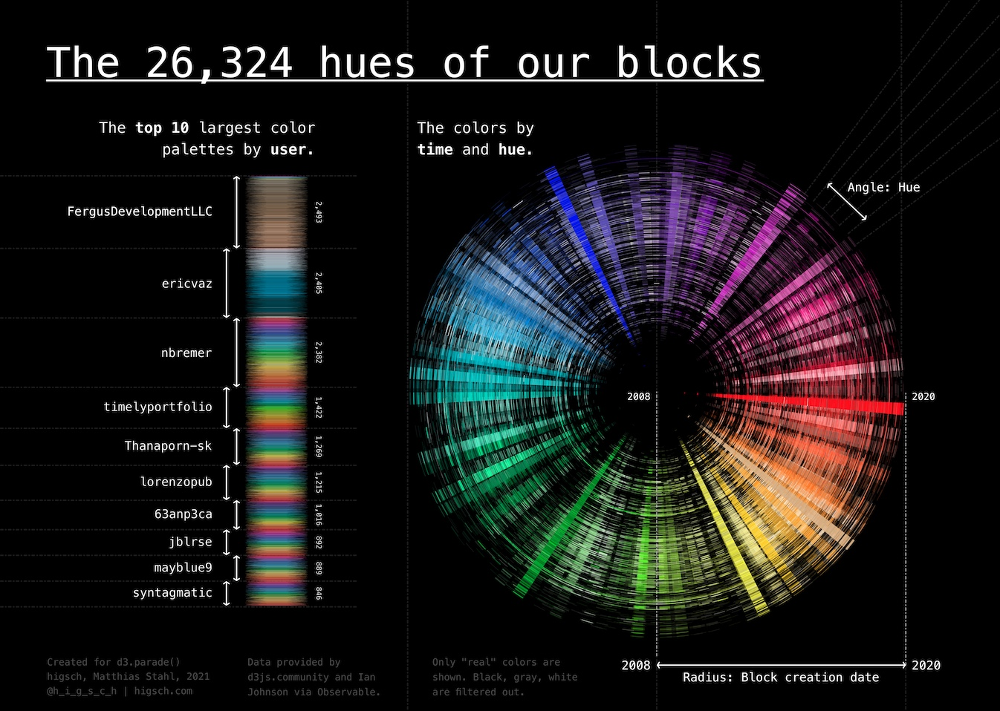

# The 26,324 hues of our blocks

> My entry for the 2021 d3.parade()





## Sources

- Blocks colors by Ian Johnson and d3js.community: [Observable](https://observablehq.com/@enjalot/blockbuilder-search-data)


## Tools

- D3 to create the two visuals
- Affinity Designer to bring everything together


## Run the D3 code on your own

You need to install [Node](https://nodejs.org/en/download/) and [npm](https://www.npmjs.com/get-npm).

1. Clone this repo.

```
git clone https://github.com/higsch/d3-parade.git
cd d3-parade
```


2. Install dependencies (D3!).

```
npm install
```


3. Run.

```
npm run start
# npm run dev # if you want to use nodemon instead
```


## Thank you D3!
